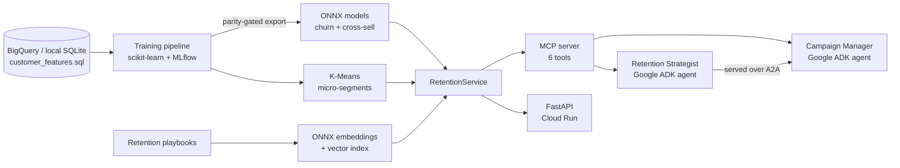

# RetainIQ: Churn Propensity Models and Retention AI Agents

RetainIQ predicts which telecom customers are likely to leave, groups them into micro-segments,
and uses AI agents to recommend an approved retention or cross-sell offer for each customer.

It combines classic propensity modeling with agentic AI:

- **Propensity models:** churn prediction and cross-sell (likelihood to buy Tech Support), trained with scikit-learn, tracked in MLflow, and served as ONNX models.
- **Micro-segmentation:** K-Means segments combined with churn-risk tiers.
- **RAG over playbooks:** ONNX-based embeddings and semantic search over approved retention playbooks, so agents never invent offers.
- **MCP server:** exposes scores, segments, and playbook search as tools any agent can use.
- **Google ADK agents:** a Retention Strategist agent and a Campaign Manager agent.
- **A2A protocol:** the Retention Strategist runs as its own service, and the Campaign Manager calls it over A2A.
- **Cloud-ready:** the same feature SQL runs on BigQuery, the API and agent deploy to Cloud Run, and the model registers in Vertex AI.

Data: [IBM Telco Customer Churn](https://github.com/IBM/telco-customer-churn-on-icp4d) dataset, 7,043 customers, 26.5% churn rate.

## Architecture



## Results

All metrics are on a held-out test set (20% of customers, stratified).

**Churn propensity model**

| Model | ROC-AUC | PR-AUC | Top-decile lift | Churners found in top 20% | ONNX parity |
|---|---|---|---|---|---|
| Logistic regression (deployed) | 0.845 | 0.652 | 2.85x | 49.7% | Pass |
| Gradient boosting | 0.843 | 0.657 | 2.91x | 49.7% | Fail (0.05) |

**Cross-sell propensity model (Tech Support add-on, internet customers)**

| Model | ROC-AUC | PR-AUC | Top-decile lift |
|---|---|---|---|
| Logistic regression (deployed) | 0.791 | 0.705 | 2.33x |
| Gradient boosting | 0.791 | 0.701 | 2.31x |

What these numbers mean for a marketing team: contacting the 20% of customers with the highest
churn scores reaches about half of all customers who would leave.

**Two engineering decisions worth noting**

1. **ONNX parity gate.** Models are ranked by PR-AUC, but a model only ships if its ONNX export
   matches scikit-learn within 1e-4. Gradient boosting scored slightly higher but failed the gate
   (ONNX stores tree split thresholds as 32-bit floats, which changed some predictions by up to
   0.05), so the pipeline deployed logistic regression. Logistic regression also gives clear,
   per-customer reasons for each score.
2. **Leakage fix.** The first cross-sell model scored a suspicious 0.996 ROC-AUC. Monthly charges
   already include the Tech Support price, so the model was reading the answer. Removing the
   charge columns brought it to a realistic 0.79. A unit test now guards against this.

**Micro-segments** (see [reports/segment_profiles.csv](reports/segment_profiles.csv))

| Segment | Customers | Churn rate |
|---|---|---|
| Mid-tenure high-spend month-to-month (manual-pay) | 1,586 | 52.5% |
| New low-spend month-to-month (manual-pay) | 1,299 | 36.2% |
| Mid-tenure mid-spend month-to-month (autopay) | 969 | 35.6% |
| Loyal high-spend contract (manual-pay) | 704 | 13.5% |
| Loyal high-spend contract (autopay) | 1,269 | 7.6% |
| Loyal low-spend contract (autopay) | 1,216 | 2.5% |

## Example: one customer, end to end

```text
$ curl localhost:8080/customers/7590-VHVEG/next-best-action
churn_score: 0.64   risk_tier: high
top_churn_drivers: low tenure months, month-to-month contract, low monthly charges
recommended_playbook: New Customer Onboarding Check-In
source: 03_new_customer_onboarding.md
```

The churn drivers come from the logistic regression: each feature's contribution compared with the
average customer.

## Quick start

```bash
git clone https://github.com/Avijit-Karmoker-CS/RetainIQ-Churn-Propensity-AI-Agents.git
cd RetainIQ-Churn-Propensity-AI-Agents
python -m venv .venv && source .venv/bin/activate
pip install -r requirements.txt && pip install --no-deps -e .

python -m retainiq.train              # train, evaluate, export ONNX, build segments and index
python -m retainiq.campaign           # build a retention and cross-sell campaign list
uvicorn retainiq.api:app --port 8080  # scoring API at http://localhost:8080/docs
pytest -q                             # 15 tests
mlflow ui --backend-store-uri sqlite:///mlflow.db   # compare model runs
```

### Run the agents (needs a free Gemini API key)

```bash
export GOOGLE_API_KEY=your-key

# Terminal 1: serve the Retention Strategist over A2A
python -m retainiq.agents.a2a_server

# Terminal 2: chat with the agents in the ADK web UI
cd src/retainiq/agents && adk web
```

Try: *"What should we offer customer 7590-VHVEG?"* (Retention Strategist) or
*"Plan this month's retention campaign."* (Campaign Manager).

### Use the MCP server from any MCP client

```bash
python -m retainiq.mcp_server          # stdio
python -m retainiq.mcp_server --http   # streamable HTTP on port 8765
```

Tools: `get_customer_profile`, `score_customer`, `list_at_risk_customers`, `get_segment_summary`,
`search_retention_playbooks`, `recommend_next_best_action`.

## Google Cloud deployment

| Step | Command |
|---|---|
| Load data into BigQuery | `bash deploy/bigquery_load.sh` |
| Train from BigQuery | `RETAINIQ_WAREHOUSE=bigquery python -m retainiq.train` |
| Deploy API and A2A agent to Cloud Run | `bash deploy/cloud_run.sh` |
| Register the model in Vertex AI | `python deploy/vertex_ai_register.py --bucket gs://YOUR_BUCKET` |

The cloud steps need a GCP project and `pip install -r requirements-gcp.txt`.

## What the tests cover

- Feature SQL, cleaning, and the leakage guard
- Model quality thresholds and the ONNX parity gate
- ONNX scores match the saved scoring table
- Playbook semantic search returns the right playbook
- Next-best-action logic for high-risk and low-risk customers
- API endpoints, including 404 for unknown customers
- A real MCP client listing and calling the server's tools
- The Google ADK agent running end to end with MCP tools (a scripted model stands in for Gemini, so CI needs no API key; this checks the agent wiring, not LLM answer quality)
- The A2A agent card and the Campaign Manager's A2A connection

## Project structure

```text
sql/customer_features.sql      feature SQL shared by BigQuery and SQLite
data/playbooks/                approved retention and cross-sell playbooks (RAG corpus)
src/retainiq/
  warehouse.py                 BigQuery and local warehouse connectors
  features.py                  feature lists and preprocessing
  train.py                     training, MLflow tracking, ONNX parity gate
  segments.py                  K-Means micro-segmentation
  embeddings.py                ONNX embeddings and vector search
  service.py                   scoring, churn drivers, next best action
  mcp_server.py                MCP server
  agents/                      Google ADK agents and the A2A server
  api.py                       FastAPI service
  campaign.py                  batch campaign builder
deploy/                        BigQuery, Cloud Run, and Vertex AI scripts
reports/                       saved model report, segments, and campaign sample
tests/                         pytest suite
```

## Notes and limits

- The dataset is a public snapshot, not live data, so there is no real time-based validation.
- The playbook offers are written for this project and are not real company policy.
- The embedding encoder is a small TF-IDF + SVD model exported to ONNX. It can be swapped for an
  exported Transformer encoder without changing the search code.
